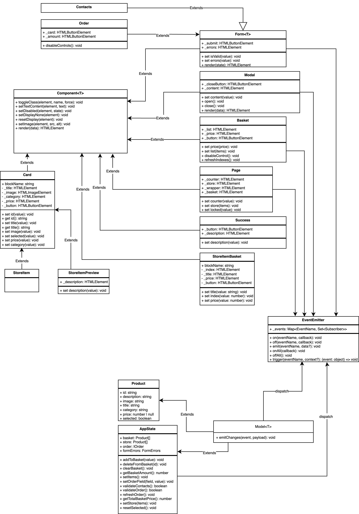

# Проектная работа "Веб-ларек"

Стек: HTML, SCSS, TS, Webpack

Структура проекта:
- src/ — исходные файлы проекта
- src/components/ — папка с JS компонентами
- src/components/base/ — папка с базовым кодом

Важные файлы:
- src/pages/index.html — HTML-файл главной страницы
- src/types/index.ts — файл с типами
- src/index.ts — точка входа приложения
- src/styles/styles.scss — корневой файл стилей
- src/utils/constants.ts — файл с константами
- src/utils/utils.ts — файл с утилитами

## Установка и запуск
Для установки и запуска проекта необходимо выполнить команды

```
npm install
npm run start
```

или

```
yarn
yarn start
```
## Сборка

```
npm run build
```

или

```
yarn build
```

## Архитектура



## Документация

### Ключевые типы данных

```TypeScript
/*
    Категории товаров
*/
type CategoryType =
  | 'другое'
  | 'дополнительное'
  | 'кнопка'
  | 'софт-скил'
  | 'хард-скил';

/*
  * Информация о единице товара
* */
interface IProduct {
  // уникальный ID
  id: string;

  // описание товара
  description: string;

  // ссылка на картинку
  image: string;

  // название
  title: string;

  // категория товара
  category: CategoryType;

  // цена товара, может быть null
  price: number | null;

  // был данный товар добавлен в корзину или нет
  selected: boolean;
}

/*
  * Внутреннее состояние приложения
  * */
interface IAppState {
  // Корзина товаров
  basket: Product[];

  // Карточки товаров
  store: Product[];

  // Информация о заказе
  order: IOrder;

  // Ошибки формы
  formErrors: FormErrors;

  // Добавление товара в корзину
  addToBasket(value: Product): void;

  // Удаление товара из корзины
  deleteFromBasket(id: string): void;

  // Очистка корзины
  clearBasket(): void;

  // Получение количества товаров в корзине
  getBasketAmount(): number;

  // Получение суммы цен всех товаров в корзине
  getTotalBasketPrice(): number;

  // Метод для добавления ID товаров в корзине в поле items для order
  setItems(): void;

  // Метод для заполнения полей формы заказа
  setOrderField(field: keyof IOrderForm, value: string): void;

  // Валидация формы "контакты"
  validateContacts(): boolean;

  // Валидация формы "заказ"
  validateOrder(): boolean;

  // Очистить order после покупки
  refreshOrder(): boolean;

  // Запись в состояние приложения информации о товарах
  setStore(items: IProduct[]): void;

  // Сброс поля selected для всех товаров
  resetSelected(): void;
}

/*
  * Информация о заказе
* */
export interface IOrder {
  // ID купленных товаров
  items: string[];

  // Способ оплаты
  payment: string;

  // Сумма заказа
  total: number;
  
  // Адрес доставки
  address: string;

  // Электронная почта
  email: string;
  
  // Телефон
  phone: string;
}

/*
  * Карточка товара
* */
interface ICard {
  // Идентификатор
  id: string;

  // Название
  title: string;

  // Категория
  category: string;

  // Описание
  description: string;

  // Путь к изображению
  image: string;

  // Цена
  price: number | null;

  // Флаг добавленного в корзину приложения
  selected: boolean;
}

/*
  * Интерфейс описывающий страницу
  * */
interface IPage {
  // Счётчик товаров в корзине
  counter: number;

  // Массив карточек с товарами
  store: HTMLElement[];

  // Переключатель для отключения прокрутки страницы
  locked: boolean;
}

/*
  * Корзина товаров
  * */
export interface IBasket {
  // Массив элементов
  list: HTMLElement[];
  
  // Общая цена
  price: number;
}
```

### Базовый код

1. Класс ```EventEmitter```
    Реализует паттерн «Наблюдатель» и позволяет подписываться на события и уведомлять подписчиков о наступлении события.

    Класс имеет методы ```on``` , ```off``` ,  ```emit```  — для подписки на событие, отписки от события и уведомления подписчиков о наступлении события соответственно.

    Дополнительно реализованы методы  ```onAll``` и  ```offAll```  — для подписки на все события и сброса всех подписчиков.

    Интересным дополнением является метод  ```trigger```, генерирующий заданное событие с заданными аргументами. Это позволяет передавать его в качестве обработчика события в другие классы. Эти классы будут генерировать события, не будучи при этом напрямую зависимыми от класса ```EventEmitter``` .

2. Класс ```Model<T>```
  
    Базовая модель для отличия от простых обьектов с данными.

    Конструктор принимает ```data``` для хранения и ```events``` для вызова эвентов.

    Класс имеет методы:
    
    ```emitChanges``` - вызывает event и при наличии ```payload``` вызывает с ним.

3. Класс ```AppState```
    
    Класс описывающий состояние приложения.

    Класс имеет такие поля:

    ```basket``` - Корзина с товарами

    ```store``` - Массив со всеми товарами

    ```order``` - Объект заказа клиента

    ```formErrors``` - Объект с ошибками форм

    Класс имеет такие методы:

    ```addToBasket``` - Метод для добавления товара в корзину
    
    ```deleteFromBasket``` - Метод для удаления товара из корзины
    
    ```clearBasket``` - Метод для полной очистки корзины
    
    ```getBasketAmount``` - Метод для получения количества товаров в корзине
    
    ```getTotalBasketPrice``` - Метод для получения суммы цены всех товаров в корзине
    
    ```setItems``` - Метод для добавления ID товаров в корзине в поле items для order
    
    ```setOrderField``` - Метод для заполнения полей email, phone, address, payment в order
    
    ```validateContacts``` - Валидация форм для окошка "контакты"
    
    ```validateOrder``` - Валидация форм для окошка "заказ"
    
    ```refreshOrder``` - Очистить order после покупки товаров
    
    ```setStore``` - Метод для превращения данных, полученных с сервера в тип данных приложения
    
    ```resetSelected``` - Метод для обновления поля selected во всех товарах после совершения покупки


    

### Классы представления

1. Класс ```Component<T>```

    Базовый класс для компонента в приложении, содержит внутри себя инструменты необходимые для управления состояния компонента.

    Класс имеет такие методы:

    ```constructor``` - Конструктор принимает родительский элемент

    ```toggleClass``` - Переключить класс

    ```setTextContent``` - Установить текстовое содержимое

    ```setDisabled``` - Сменить статус блокировки

    ```setDisplayNone``` - Скрыть

    ```resetDisplay``` - Показать

    ```setImage``` - Установить изображение с альтернативным текстом

    ```render``` - Вернуть корневой DOM-элемент


2. Класс ```Form<T>```

    Базовый класс для компонентов с формами, наследуется от класса ```Component```, а так же включает себя инструменты для контроля и валидации формы

    Класс содержит такие поля:

    ```_submit``` - Ссылка на внутренний элемент кнопки отправки формы
    ```_errors``` - Ссылка на внутренний элемент блока ошибок формы

    Класс имеет такие методы:

    ```isValid``` - Сеттер для установки состояния доступности кнопки отправки формы

    ```errors``` - Сеттер для установки текста ошибок формы

    ```render``` - Метод для отображения состояния формы

    ```onInputChange``` - Метод для обработки изменений ввода формы


3. Класс ```Page```

    Класс, описывающий главную страницу наследуется от класса ```Component```

    Класс имеет такие методы:

    ```constructor``` - Конструктор принимает родительский элемент и обработчик событий

    ```counter``` - Сеттер для счётчика товаров в корзине

    ```store``` - Сеттер для карточек товаров на странице

    ```locked``` - Сеттер для блока прокрутки


4. Класс ```Card```

    Класс, описывающий карточку товара наследуется от класса ```Component```

    Класс имеет такие методы:

    ```constructor``` - Конструктор принимает имя блока, родительский контейнер и объект с колбэк функциями

    ```id``` - Сеттер и геттер для уникального ID

    ```title``` - Сеттер и геттер для названия

    ```image``` - Сеттер для кратинки

    ```selected``` - Сеттер для определения выбрали товар или нет

    ```price``` - Сеттер для цены

    ```category``` - Сеттер для категории


5. Класс ```Basket```

    Класс, описывающий корзину товаров наследуется от класса ```Component```

    Класс имеет такие методы:

    ```constructor``` - Конструктор принимает имя блока, родительский элемент и обработчик событий

    ```price``` - Сеттер для общей цены

    ```list``` - Сеттер для списка товаров 

    ```disableControl``` - Метод отключающий кнопку "Оформить"

    ```refreshIndexes``` - Метод для обновления индексов таблички при удалении товара из корзины


6. Класс ```Order```

    Класс, описывающий окошко заказа товара наследуется от класса ```Form```

    Класс имеется такие поля:

    ```_card``` - Сссылки на внутренние элементы

    ```_amount``` - Сссылки на внутренние элементы

    Класс имеет такие методы:

    ```constructor``` - Конструктор принимает имя блока, родительский элемент и обработчик событий

    ```disableControls``` - Метод, отключающий подсвечивание кнопок


7. Класс ```Contacts```

    Класс, описывающий окошко заказа товара наследуется от класса ```Form```
    
    Класс имеет такие методы:

    ```constructor``` - Конструктор принимает родительский элемент и обработчик событий

